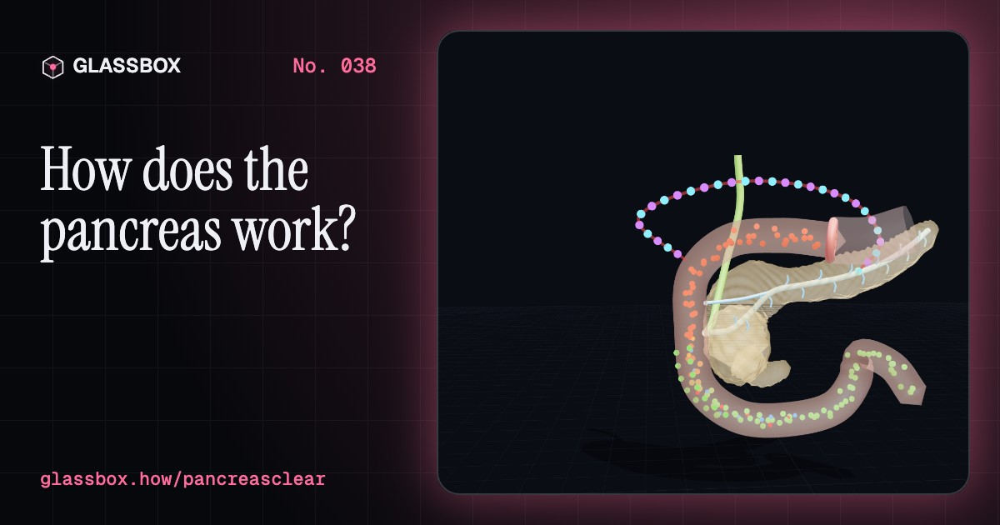
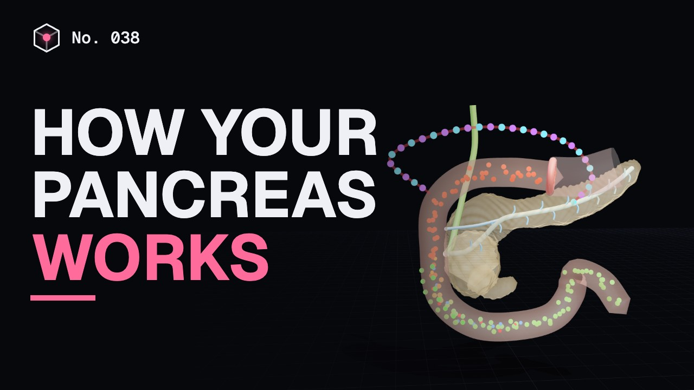
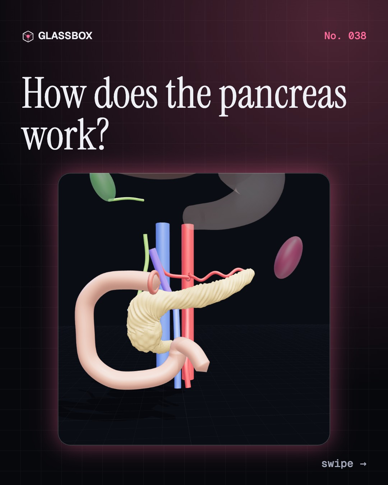
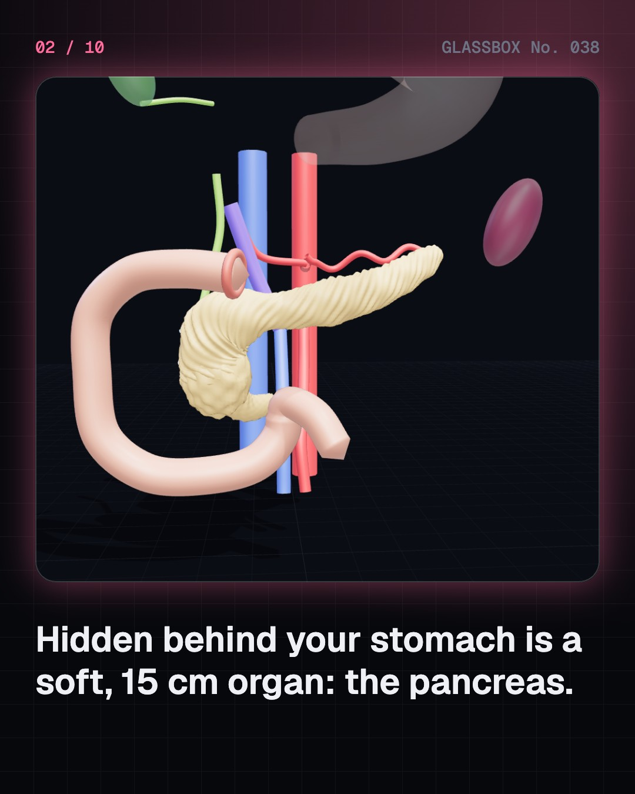
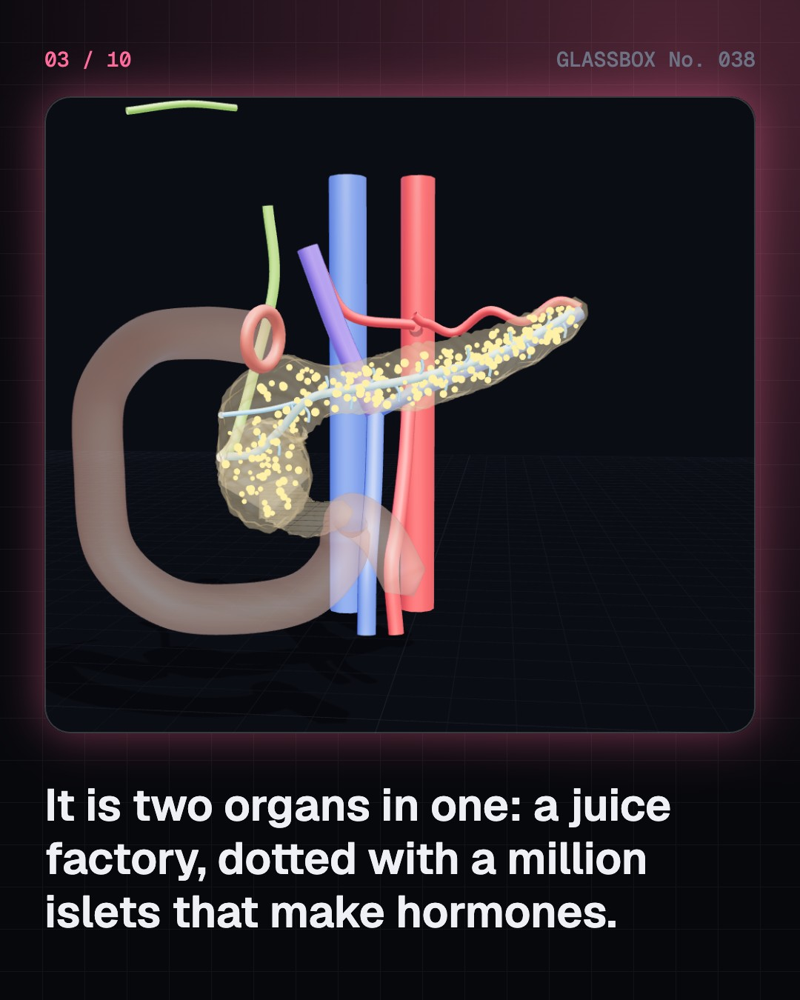
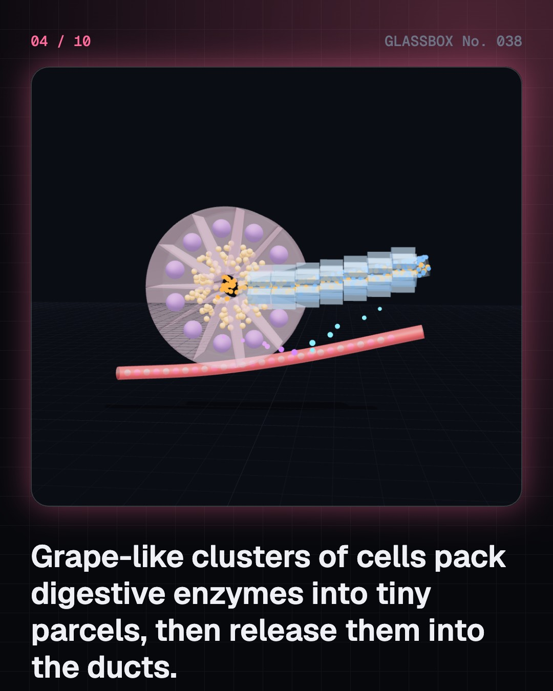

<!-- glassbox:start -->
<!-- Generated from glassbox.json by the Glassbox hub (npm run readme -- pancreasclear). Edit glassbox.json, not this block. -->
<p align="center"><a href="https://glassbox.how/e/pancreasclear/"></a></p>

<h1 align="center">PancreasClear</h1>

<p align="center"><b>How does the pancreas work?</b><br>Behind your stomach sits a soft, 15 cm organ that does two jobs at once: it pours out a litre or more of digestive juice a day, and a million tiny islands inside it keep your blood sugar steady with insulin. Take it apart in 3D, watch a beta cell taste sugar, and see what goes wrong in diabetes.</p>

<p align="center"><a href="https://glassbox.how/pancreasclear/"><b>▶ Play with it</b></a> &nbsp;·&nbsp; <a href="https://glassbox.how/e/pancreasclear/">Read the 60-second explainer</a> &nbsp;·&nbsp; <a href="https://glassbox.how/pancreasclear/glassbox/reel.mp4">Watch the 40-second video</a></p>

<p align="center">
  <a href="https://glassbox.how/e/pancreasclear/"></a>
  <a href="https://glassbox.how/e/pancreasclear/"></a>
  <a href="LICENSE"></a>
  <a href="LICENSE-CONTENT.md"></a>
  <a href="#privacy"></a>
</p>

## In 60 seconds

1. **Two organs in one.** The pancreas lies behind the stomach, about 15 cm long and 80 g, with its head in the C of the duodenum and its tail at the spleen. About 98% of it makes digestive juice; about a million islets of Langerhans, just 1 to 2% of it, make hormones such as insulin.
2. **A juice factory with a safety lock.** Acinar cells make amylase, lipase and protein-cutting enzymes, about 1 to 1.5 litres of juice a day. Trypsin is made switched off and only switched on in the gut by enteropeptidase, so the pancreas does not digest itself. Duct cells add bicarbonate to neutralise stomach acid, on cue from the hormones secretin and CCK.
3. **A cell that tastes sugar.** Beta cells burn glucose to make ATP. ATP shuts potassium channels, the cell's voltage rises, calcium rushes in, and insulin granules release. More sugar means more insulin. Alpha cells do the opposite job with glucagon.
4. **A thermostat for blood sugar.** Insulin lets muscle and fat take in glucose and tells the liver to store it; glucagon tells the liver to release it. Together they keep blood glucose around 70 to 100 mg/dL before breakfast and usually below about 140 after meals, though the whole bloodstream holds only about a teaspoon of sugar.
5. **When the thermostat breaks.** In type 1 diabetes the immune system destroys the beta cells. In type 2, the most common kind, cells resist insulin and beta cells slowly fall behind. HbA1c shows average glucose over about three months. About 589 million adults worldwide, and an estimated 101 million people in India, live with diabetes. Only doctors diagnose it.
6. **Keeping it healthy.** Pancreatitis happens when enzymes switch on inside the gland, most often after gallstones or heavy alcohol use, and needs urgent care. Pancreatic cancer is hard to find early. Studies in the USA and India found that lifestyle programmes lowered the chance of type 2 in people with raised glucose. For your own health, talk to a doctor.

## Words worth knowing

| Term | Meaning |
|---|---|
| **Exocrine and endocrine** | Exocrine glands send their product down ducts, like digestive juice; endocrine glands release hormones into the blood, like insulin. |
| **Acinus** | A grape-like cluster of enzyme-making cells around a tiny central channel. |
| **Zymogen** | An enzyme made switched off, such as trypsinogen, so it cannot do damage until it reaches the gut. |
| **Secretin and CCK** | Hormones from the duodenum that tell the pancreas to send bicarbonate and enzymes when food arrives. |
| **Islet of Langerhans** | A tiny cluster of hormone-making cells; about a million are scattered through the pancreas. |
| **Insulin** | The hormone from beta cells that lets cells take in glucose and tells the liver to store it. |
| **Glucagon** | The hormone from alpha cells that tells the liver to release glucose when blood sugar falls. |
| **Insulin resistance** | When cells respond less to insulin, so more is needed to do the same job; central to type 2 diabetes. |
| **HbA1c** | A blood test showing how much haemoglobin has glucose attached, a guide to average glucose over about three months. |

## A short history

**2,500 years from 'honey urine' in ancient India to sensors that talk to insulin pumps.**

- **500 BCE** · Madhumeha: 'honey urine' (Sushruta and Charaka (texts attributed to them), Ancient India)
- **300 BCE** · The pancreas is first described (Herophilus of Chalcedon, Alexandria, Egypt)
- **1674** · Urine 'wonderfully sweet' (Thomas Willis, London and Oxford, England)
- **1869** · Islands in the pancreas (Paul Langerhans, Berlin, Germany)
- **1889** · No pancreas, then diabetes (Oskar Minkowski and Joseph von Mering, Strasbourg (then Germany, now France))
- **1902** · The first hormone: secretin (William Bayliss and Ernest Starling, University College London, England)
- **1922** · Leonard Thompson gets insulin (Leonard Thompson, treated by the Toronto team, Toronto General Hospital, Canada)
- **1923** · A Nobel Prize, and a patent for $1 (Banting, Macleod, Best and Collip, Stockholm, Sweden, and Toronto, Canada)

The full story, with 28 moments, charts, people and 38 sources: [glassbox.how/e/pancreasclear/history](https://glassbox.how/e/pancreasclear/history/). The data lives in [`history.json`](history.json).

## Video and slides

Made with the Glassbox studio from this box's storyboard (`window.glassbox.director`). Free to reuse under CC BY 4.0.

<a href="https://glassbox.how/pancreasclear/glassbox/video.mp4"></a>

<p><a href="glassbox/slide-1.jpg"></a> <a href="glassbox/slide-2.jpg"></a> <a href="glassbox/slide-3.jpg"></a> <a href="glassbox/slide-4.jpg"></a></p>

| File | What | Size |
|---|---|---|
| [`glassbox/reel.mp4`](https://glassbox.how/pancreasclear/glassbox/reel.mp4) | Reel / Short, with captions and soundtrack | 1080×1920 |
| [`glassbox/video.mp4`](https://glassbox.how/pancreasclear/glassbox/video.mp4) | YouTube video, with captions and soundtrack | 1920×1080 |
| `glassbox/slide-1…10.jpg` | Instagram carousel | 1080×1350 |
| `glassbox/thumb.jpg` | YouTube thumbnail | 1280×720 |
| `glassbox/cover.jpg` | Share card and repo social preview | 1200×630 |
| [`glassbox/history-reel.mp4`](https://glassbox.how/pancreasclear/glassbox/history-reel.mp4) | “History in 10 moments” Reel / Short | 1080×1920 |
| `glassbox/history-slide-*.jpg` | History carousel | 1080×1350 |
| `glassbox/post.json` | Post copy and schedule used by the publish kit | |

## Privacy

This box has no accounts and no ads, and it ships its own fonts and libraries. When you run it yourself it sends nothing anywhere. On glassbox.how, the site's `/bar.js` also loads Glassbox's analytics: **Google Analytics** to count visits (it asks first in the EU, UK and Switzerland, and stays off when your browser sends Global Privacy Control or Do Not Track) and **ClickTrust** to detect bots.

It remembers a few things **in your own browser only**, and never sends them anywhere:

| Browser storage key | What it holds |
|---|---|
| `pancreasclear.v1` | Which chapters you have opened, your best quiz scores, and sound on or off. |

Exactly what each one sees is at [glassbox.how/privacy](https://glassbox.how/privacy/).

## Licences

- **Code:** [MIT](LICENSE). Use it, change it, ship it.
- **Explanations, text, images and videos** (`glassbox.json`, `glassbox/`): [CC BY 4.0](LICENSE-CONTENT.md). Credit “Glassbox, glassbox.how/e/pancreasclear”.
- **Third-party parts** keep their own licences: [three.js](https://threejs.org) (MIT), [Geist, Instrument Serif](https://openfontlicense.org) (SIL OFL 1.1).
- The Glassbox name and logo aren't covered by either licence. See the [terms](https://glassbox.how/terms/).

Found a mistake? [Open an issue](https://github.com/bdeeps/pancreasclear/issues). Corrections happen in public.
<!-- glassbox:end -->

## Run it

It's plain HTML, CSS and JavaScript. No build step and no dependencies. Run locally, it contacts no other website.

```bash
python3 -m http.server 8000
```

Three.js and the fonts ship in `vendor/` and `fonts/`, so it also works offline.

Then open http://localhost:8000.

## How it's built

| File | What |
|---|---|
| `index.html`, `css/app.css` | The page and its styles |
| `js/app.js`, `js/stage.js`, `js/ui.js`, `js/kit.js` | The shared Glassbox 3D engine: chapters, 3D stage, controls, quiz, video director |
| `js/chapters/*.js` | One file per chapter: the 3D model, controls, text, key terms, quiz and video scenes |
| `js/pancreas.js` | Shared 3D models: the pancreas with its ducts, vessels and neighbours, an islet of Langerhans, the glucose chart, labels |
| `js/glucose.js`, `js/body.js` | The blood-glucose day model (typical, type 1, type 2; sources in the file) and the stylised body loop it drives |
| `glassbox.json` | Title, question, explainer beats, key terms, browser storage and credits shown on glassbox.how |
| `reel` in each chapter | The storyboard the Glassbox studio records into short videos |
| `glassbox/` | The published video, slides, thumbnail and post copy |
| `fonts/`, `vendor/three/` | Self-hosted Geist and Instrument Serif (SIL OFL 1.1) and three.js (MIT) |
